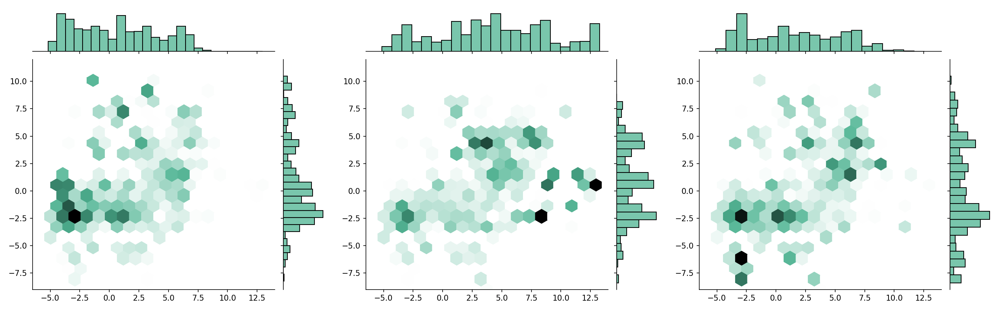
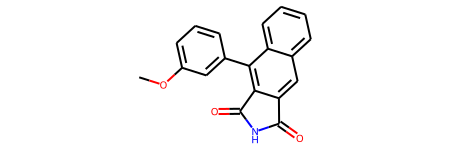
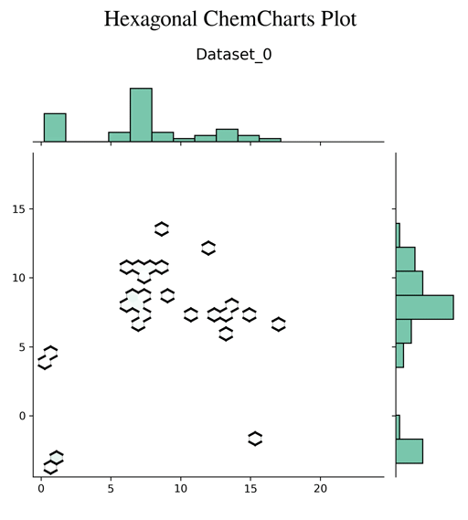

# ChemCharts


## Description
`Chemcharts` is an open source program designed to visualize the distribution of molecules in chemical space. It allows for data parsing and preparation and then generates various plots or movies. In order to generate graphical representations that are interpretable, `ChemCharts` reduces the high-dimensional fingerprint representation to 2D embedded coordinates. There are two ways to run it, either via a command-line entry point, or, for full control over all settings, by specifying a JSON configuration file. While `ChemCharts` is input agnostic to some extent, it is particularly useful as a post-processing step to compound generative modelling with [```REINVENT```](https://github.com/MolecularAI/Reinvent), which has a so-called "scaffold memory" as its final output.

## Data input
`ChemCharts` accepts input from one or multiple datasets in csv format. The file needs to include columns with molecules in SMILES format and scores (when time resolution is desired, an epoch/step column should be included too). The scatter_boxplot_plot allows group colouring which requires an additional column defining the belonging of molecules. For the developing process as well as the notebook, datasets have been generated with ```REINVENT``` (open source), see [Example Dataset](https://github.com/ChemCharts/ChemCharts/data/Scaffold_Example_Reinvent_Dataset.zip).

## What can ChemCharts do?

1. In the first step `ChemCharts` transforms SMILES to fingerprints by using the ```RDKit``` fingerprint functions (the user can choose between standard, Morgan and MACCS fingerprints) 



```
COc1cccc(-c2c3c(cc4ccccc24)C(=O)NC3=O)c1 ⮕ [1, 1, 1, 0, 0, 0, 0, 1, 0, 1, 0, 0, 0, 0, 0, 0, ...]
```


2. Then, `ChemCharts` reduces the fingerprints with the ```UMAP``` dimensionality reduction algorithm.


3. For further adjustments, the user can define a filter range and/ or the desired number of clusters (using KMeans).


4. Binning of median scores is possible and will be visualized in a histogram plot (the amount of bins can thereby be defined by the user).


5. When it comes to the plot generation step, the following types can be chosen:
    * [scatter static plot](img/scatter_static_plot.png)
    * [scatter boxplot plot (colour grouping)](img/scatter_boxplot_plot.png)
    * [scatter interactive plot (only static preview available)](img/scatter_interactive_plot.png)
    * [histogram plot (scores)](img/histogram_plot.png)
    * [trisurf static plot](img/trisurf_static_plot.png)
    * [trisurf interactive plot (only static preview available)](img/trisurf_interactive_plot.png)
    * [hexagonal plot (default)](img/hexagonal_plot.png)
   
    For interactive plots a view setting can be chosen, which allows for a pop-up browser window of the interactive plot.
    
    If multiple datasets are provided, plots will be merged in columns of three (except interactive plots).
    

6. And last, `ChemCharts` can also make a movie for most plot types. This works by treating incremental epoch numbers as some sort of time axis, i.e. one can follow the agent sample over the course of the reinforcement learning.




## Requirements
* Anaconda or Miniconda with Python > 3.7
* Installation of the environment:

```conda env create -f environment_min.yml```

* Install `ChemCharts` from `pip`:
```
conda activate chemcharts
pip install chemcharts
```

* Or install the latest version from source:
```
conda activate chemcharts
pip install -e .
```

* Note, that you need `ffmpeg` installed on your computer in case you want to generate movies. On Ubuntu it will look something like:

```
sudo apt update
sudo apt install ffmpeg
```

## Usage
* Activate environment:

```conda activate chemcharts```

* Execution of command-line interface (CLI) / entry point:

```chemcharts_cli -input_data data/scaffold_memory.csv -output_plot test.png```

* Execution of `JSON` interface / entry point:

```
chemcharts -conf examples/json/data_prep_plot.json
chemcharts -conf examples/json/simple_plot_test.json
```

* Execution of unit tests:

```python main_test.py```

## Instructions and tutorials
For detailed guides on how to use `JSON` for generating `ChemCharts` plots, see notebook templates for plot [Learning Demo Chemcharts Json Plot](notebooks/Learning_Demo_Chemcharts_JSON_Plot.ipynb) or movie generation [Learning Demo Chemcharts Json Movie](notebooks/Learning_Demo_Chemcharts_JSON_Movie.ipynb). For in-depth explanations of the `ChemCharts` entry points, please see: [Learning Demo Chemcharts Entry Point](notebooks/Learning_Demo_Chemcharts_Entry_Point.ipynb).

## Bugs and feature requests
Please don't hesitate to let us know (open an issue) if you find a bug, want to request a feature or to make a pull request.

## Contributors
- Sophie Margreitter [@smargreitter](https://github.com/SMargreitter)
- Christian Margreitter [@cmargreitter](https://github.com/CMargreitter)
